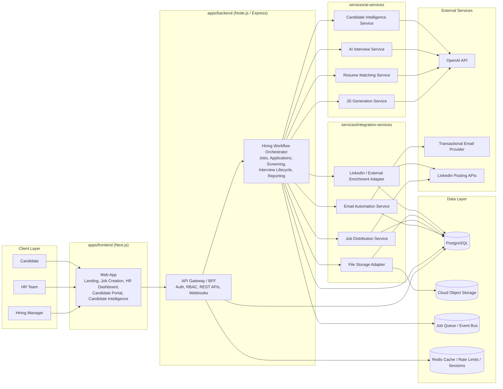

# AI Hiring Intelligence Platform Architecture

## 1. System Architecture Diagram

## 2. Service Boundaries

### `apps/frontend`
- Owns all user-facing experiences.
- Server-side rendering for landing pages, authenticated dashboards, and candidate application flows.
- Calls backend APIs only; no direct database or third-party access.
- Key surfaces:
  - Landing page
  - Hiring manager job intake and JD review
  - HR approval dashboard
  - Candidate application portal
  - Candidate intelligence profile pages

### `apps/backend`
- Single entry point for web and internal API traffic.
- Enforces authentication, authorization, request validation, idempotency, auditing, and workflow orchestration.
- Owns core domain logic for jobs, applications, interview progression, and reporting.
- Publishes async work to queue for AI and integration services.

### `services/ai-services`
- Stateless AI task processors invoked asynchronously and, where needed, synchronously for low-latency tasks.
- Encapsulates prompt management, model routing, output validation, scoring normalization, and fallback handling.
- No UI responsibilities.

### `services/integration-services`
- Handles outbound integrations and callback processing.
- Owns storage uploads, email delivery orchestration, LinkedIn posting, and external profile enrichment connectors.
- Retries transient failures and records delivery/posting status.

### `packages/database`
- PostgreSQL schema, migrations, seed helpers, query utilities, and ORM models.
- Shared data contracts for services that access persistent storage.

### `packages/shared-types`
- Shared TypeScript types, DTOs, enums, API contracts, event payloads, and validation schemas.

## 3. Microservice Responsibilities

### API Gateway / BFF (`apps/backend`)
- Session or token authentication.
- RBAC for `manager`, `hr`, `admin`, `candidate`.
- REST API composition for frontend.
- Rate limiting, request tracing, audit logging.

### Hiring Workflow Orchestrator (`apps/backend`)
- Job intake lifecycle.
- HR approval workflow.
- Application intake and status transitions.
- Screening pipeline coordination.
- Interview session creation and progression.
- Candidate profile aggregation for manager views.

### JD Generation Service (`services/ai-services`)
- Converts structured intake answers into a draft job description.
- Produces responsibilities, skills, experience, salary summary, location/relocation guidance, and screening constraints.
- Stores prompt/output versions for auditability.

### Resume Matching Service (`services/ai-services`)
- Extracts normalized resume data.
- Compares candidate profile with job requirements.
- Produces match score, reasons, missing skills, and recommendation flags.
- Applies rule: `score >= 70` proceeds unless manually overridden.

### AI Interview Service (`services/ai-services`)
- Generates 4-6 contextual questions from job description and candidate data.
- Stores question sequence, answers, transcript, per-question evaluation, and rollup scores.
- Produces communication, knowledge, and confidence scores plus interview summary.

### Candidate Intelligence Service (`services/ai-services`)
- Consolidates permanent candidate profile.
- Generates resume insights, LinkedIn insights, claim verification flags, manager follow-up questions, and hiring recommendation.
- Maintains application history snapshots and reusable candidate knowledge base.

### Email Automation Service (`services/integration-services`)
- Sends transactional emails for:
  - application received
  - interview invitation
  - interview completed
  - shortlisted
  - rejected
- Tracks provider status, opens, bounces, and failures.

### Job Distribution Service (`services/integration-services`)
- Posts approved jobs to LinkedIn.
- Enforces external apply URL back to platform application page.
- Explicitly disables or avoids Easy Apply configuration.
- Tracks posting status, remote job board IDs, and sync history.

### File Storage Adapter (`services/integration-services`)
- Generates secure upload URLs.
- Stores resume and attachment metadata.
- Manages virus-scan hooks and retention rules.

### External Enrichment Adapter (`services/integration-services`)
- Persists LinkedIn URL references and enrichment results when permitted.
- Normalizes external profile signals into candidate insights.

## 4. Scalable PostgreSQL Database Design

### Design Principles
- UUID primary keys on all entities.
- `created_at`, `updated_at` on all mutable tables.
- Soft delete via `deleted_at` where business recovery matters.
- JSONB for AI artifacts and provider payloads; relational tables for filterable workflow data.
- Partition high-volume event tables by month when scale requires it.

### Core Tables

#### `users`
| Column | Type | Notes |
|---|---|---|
| id | uuid pk | |
| organization_id | uuid fk | multi-tenant boundary |
| email | citext unique | login identity |
| password_hash | text nullable | nullable for SSO |
| first_name | text | |
| last_name | text | |
| role | user_role enum | `admin`, `hr`, `manager` |
| status | user_status enum | `invited`, `active`, `disabled` |
| last_login_at | timestamptz nullable | |
| created_at | timestamptz | |
| updated_at | timestamptz | |

Indexes:
- `(organization_id, role)`
- unique `(organization_id, email)`

#### `candidates`
| Column | Type | Notes |
|---|---|---|
| id | uuid pk | permanent candidate profile |
| organization_id | uuid fk nullable | nullable for shared talent pool if desired |
| full_name | text | |
| email | citext nullable | |
| phone | text nullable | |
| linkedin_url | text nullable | |
| location_text | text nullable | |
| current_title | text nullable | |
| years_experience | numeric(4,1) nullable | |
| current_company | text nullable | |
| source | candidate_source enum | portal, linkedin, referral, recruiter |
| profile_status | candidate_profile_status enum | active, archived, blocked |
| canonical_resume_file_id | uuid fk nullable | latest preferred resume |
| created_at | timestamptz | |
| updated_at | timestamptz | |

Indexes:
- `(organization_id, email)`
- `(organization_id, full_name)`
- GIN on `to_tsvector('english', full_name || ' ' || coalesce(current_title,''))`

#### `jobs`
| Column | Type | Notes |
|---|---|---|
| id | uuid pk | |
| organization_id | uuid fk | |
| created_by_user_id | uuid fk | manager |
| approved_by_user_id | uuid fk nullable | HR approver |
| title | text | |
| department | text nullable | |
| employment_type | employment_type enum | full_time, contract, etc. |
| location_type | location_type enum | remote, hybrid, onsite |
| location_text | text nullable | |
| salary_min | numeric(12,2) nullable | |
| salary_max | numeric(12,2) nullable | |
| currency_code | char(3) nullable | |
| target_start_date | date nullable | |
| relocation_required | boolean default false | |
| intake_answers | jsonb | structured AI intake responses |
| description_draft | text nullable | |
| description_final | text nullable | |
| screening_config | jsonb | thresholds and constraints |
| status | job_status enum | draft, pending_hr, approved, rejected, published, closed |
| published_at | timestamptz nullable | |
| linkedin_post_url | text nullable | |
| created_at | timestamptz | |
| updated_at | timestamptz | |

Indexes:
- `(organization_id, status)`
- `(organization_id, created_by_user_id)`
- `(published_at)`

#### `applications`
| Column | Type | Notes |
|---|---|---|
| id | uuid pk | |
| organization_id | uuid fk | |
| candidate_id | uuid fk | |
| job_id | uuid fk | |
| source | application_source enum | platform, linkedin_redirect, referral |
| status | application_status enum | received, screened_out, qualified, interview_invited, interview_completed, shortlisted, rejected, hired |
| resume_file_id | uuid fk nullable | uploaded for this application |
| cover_letter_text | text nullable | |
| linkedin_url_snapshot | text nullable | |
| applied_at | timestamptz | |
| current_stage_at | timestamptz | |
| rejection_reason_code | text nullable | |
| created_at | timestamptz | |
| updated_at | timestamptz | |

Constraints:
- unique `(candidate_id, job_id)`

Indexes:
- `(organization_id, job_id, status)`
- `(organization_id, candidate_id)`
- `(applied_at desc)`

#### `interview_sessions`
| Column | Type | Notes |
|---|---|---|
| id | uuid pk | |
| organization_id | uuid fk | |
| application_id | uuid fk | |
| candidate_id | uuid fk | redundancy for query speed |
| job_id | uuid fk | redundancy for query speed |
| interview_type | interview_type enum | ai_screen |
| status | interview_status enum | scheduled, in_progress, completed, abandoned, failed |
| started_at | timestamptz nullable | |
| completed_at | timestamptz nullable | |
| communication_score | numeric(5,2) nullable | 0-100 |
| knowledge_score | numeric(5,2) nullable | 0-100 |
| confidence_score | numeric(5,2) nullable | 0-100 |
| overall_score | numeric(5,2) nullable | |
| summary | text nullable | |
| transcript | jsonb nullable | full ordered transcript |
| model_metadata | jsonb nullable | model, prompt version |
| created_at | timestamptz | |
| updated_at | timestamptz | |

Indexes:
- `(organization_id, job_id, status)`
- `(organization_id, candidate_id)`

#### `interview_questions`
| Column | Type | Notes |
|---|---|---|
| id | uuid pk | |
| interview_session_id | uuid fk | |
| sequence_no | int | order |
| question | text | required |
| answer | text nullable | required once answered |
| evaluation_score | numeric(5,2) nullable | per requirement |
| evaluation_notes | text nullable | |
| competency_tag | text nullable | |
| asked_at | timestamptz nullable | |
| answered_at | timestamptz nullable | |
| created_at | timestamptz | |

Constraints:
- unique `(interview_session_id, sequence_no)`

Indexes:
- `(interview_session_id, sequence_no)`

#### `candidate_insights`
| Column | Type | Notes |
|---|---|---|
| id | uuid pk | |
| organization_id | uuid fk | |
| candidate_id | uuid fk | |
| application_id | uuid fk nullable | app-specific snapshot |
| job_id | uuid fk nullable | |
| insight_type | candidate_insight_type enum | resume_analysis, linkedin_insights, interview_summary, claim_verification, manager_questions, hiring_recommendation |
| content | jsonb | normalized AI output |
| summary_text | text nullable | |
| confidence_score | numeric(5,2) nullable | |
| source_version | text nullable | prompt/model version |
| created_by_service | text | |
| created_at | timestamptz | |
| updated_at | timestamptz | |

Indexes:
- `(organization_id, candidate_id, insight_type, created_at desc)`
- `(application_id, insight_type)`

#### `email_events`
| Column | Type | Notes |
|---|---|---|
| id | uuid pk | |
| organization_id | uuid fk | |
| application_id | uuid fk nullable | |
| candidate_id | uuid fk nullable | |
| job_id | uuid fk nullable | |
| template_key | text | |
| provider_message_id | text nullable | |
| event_type | email_event_type enum | queued, sent, delivered, opened, clicked, bounced, failed |
| recipient_email | citext | |
| payload | jsonb | template vars/provider payload |
| occurred_at | timestamptz | |
| created_at | timestamptz | |

Indexes:
- `(organization_id, application_id, occurred_at desc)`
- `(provider_message_id)`
- `(event_type, occurred_at desc)`

### Supporting Tables

#### `organizations`
- Tenant root for data isolation.
- Fields: `id`, `name`, `slug`, `status`, `settings_json`, timestamps.

#### `job_approvals`
- Tracks HR review edits and decisions.
- Fields: `id`, `job_id`, `reviewed_by_user_id`, `decision`, `notes`, `before_snapshot`, `after_snapshot`, `reviewed_at`.

#### `job_posts`
- External publication records.
- Fields: `id`, `job_id`, `channel`, `external_post_id`, `external_url`, `status`, `payload`, timestamps.

#### `candidate_files`
- Resume and attachment metadata.
- Fields: `id`, `candidate_id`, `application_id`, `storage_key`, `file_name`, `mime_type`, `file_size_bytes`, `file_kind`, `checksum_sha256`, `uploaded_at`.

#### `resume_screenings`
- Structured screening output.
- Fields: `id`, `application_id`, `match_score`, `decision`, `strengths_json`, `gaps_json`, `raw_output_json`, `screened_at`.

#### `qualification_responses`
- Candidate answers for joining timeline, salary, relocation.
- Fields: `id`, `application_id`, `joining_timeline_days`, `expected_salary`, `currency_code`, `relocation_willing`, `meets_constraints`, `evaluated_at`.

#### `application_stage_events`
- Immutable stage transitions for auditability.
- Fields: `id`, `application_id`, `from_status`, `to_status`, `actor_type`, `actor_id`, `reason`, `metadata_json`, `created_at`.

#### `candidate_claims`
- Verification flags extracted from resume/interview.
- Fields: `id`, `candidate_id`, `application_id`, `claim_type`, `claim_text`, `verification_status`, `evidence_json`, timestamps.

#### `manager_question_suggestions`
- Suggested follow-up questions for human interviewers.
- Fields: `id`, `candidate_id`, `application_id`, `job_id`, `question_text`, `rationale`, `priority`, `created_at`.

#### `audit_logs`
- Compliance and operational auditing.
- Fields: `id`, `organization_id`, `actor_user_id`, `entity_type`, `entity_id`, `action`, `metadata_json`, `created_at`.

### Key Relationships
- `organizations 1:N users`
- `organizations 1:N jobs`
- `organizations 1:N candidates`
- `jobs 1:N applications`
- `candidates 1:N applications`
- `applications 1:N interview_sessions`
- `interview_sessions 1:N interview_questions`
- `candidates 1:N candidate_insights`
- `applications 1:N email_events`

### Scale / Performance Notes
- Partition `email_events` and `application_stage_events` by `occurred_at/created_at`.
- Add read replicas for reporting-heavy HR dashboards.
- Use materialized views or async aggregates for dashboard counters.
- Prefer JSONB only for AI payloads that are not heavily filtered.

## 5. API Structure

Base path: `/api/v1`

### Auth
- `POST /auth/login`
- `POST /auth/logout`
- `POST /auth/refresh`
- `GET /auth/me`

### Jobs
- `POST /jobs`
  - Create job shell with title only.
- `POST /jobs/:jobId/intake`
  - Save structured intake answers.
- `POST /jobs/:jobId/generate-description`
  - Trigger AI JD generation.
- `PATCH /jobs/:jobId`
  - Edit job content and constraints.
- `POST /jobs/:jobId/submit-for-approval`
- `POST /jobs/:jobId/approve`
- `POST /jobs/:jobId/reject`
- `POST /jobs/:jobId/publish`
- `GET /jobs`
- `GET /jobs/:jobId`
- `GET /jobs/:jobId/applications`

### Candidate Job Portal
- `GET /public/jobs`
- `GET /public/jobs/:jobId`
- `POST /public/jobs/:jobId/apply`
  - Multipart resume upload + LinkedIn URL.
- `POST /public/uploads/resume-url`
  - Pre-signed upload URL flow if needed.

### Applications / Screening
- `GET /applications`
- `GET /applications/:applicationId`
- `POST /applications/:applicationId/screen-resume`
- `POST /applications/:applicationId/submit-qualification`
- `POST /applications/:applicationId/evaluate-qualification`
- `POST /applications/:applicationId/start-interview`
- `POST /applications/:applicationId/shortlist`
- `POST /applications/:applicationId/reject`

### Interviews
- `GET /interviews/:sessionId`
- `POST /interviews/:sessionId/questions/next`
- `POST /interviews/:sessionId/questions/:questionId/answer`
- `POST /interviews/:sessionId/complete`
- `GET /interviews/:sessionId/transcript`

### Candidate Intelligence
- `GET /candidates`
- `GET /candidates/:candidateId`
- `GET /candidates/:candidateId/applications`
- `GET /candidates/:candidateId/insights`
- `POST /candidates/:candidateId/refresh-insights`
- `GET /candidates/:candidateId/manager-prep`

### Dashboards / Reporting
- `GET /dashboard/hr/summary`
- `GET /dashboard/hr/candidates`
- `GET /dashboard/manager/jobs`
- `GET /dashboard/manager/jobs/:jobId/pipeline`

### Integrations
- `POST /integrations/linkedin/jobs/:jobId/publish`
- `POST /integrations/email/send`
- `POST /webhooks/email`
- `POST /webhooks/linkedin`

### Internal Service Endpoints
- `POST /internal/ai/jd-generate`
- `POST /internal/ai/resume-match`
- `POST /internal/ai/interview-generate`
- `POST /internal/ai/interview-score`
- `POST /internal/ai/candidate-insights`
- `POST /internal/integrations/email-dispatch`
- `POST /internal/integrations/job-publish`

### Event Contracts
- `job.submitted_for_approval`
- `job.approved`
- `job.published`
- `application.received`
- `application.screened_out`
- `application.qualified`
- `interview.invited`
- `interview.completed`
- `candidate.shortlisted`
- `candidate.rejected`

## 6. Deployment Model

### Monorepo Mapping
- `/apps/frontend`
  - Next.js app deployed as web tier.
- `/apps/backend`
  - Express API deployed as stateless application tier.
- `/services/ai-services`
  - Containerized worker/service for AI workloads.
- `/services/integration-services`
  - Containerized worker/service for outbound integrations and webhooks.
- `/packages/database`
  - Shared schema and migrations used by backend/services.
- `/packages/shared-types`
  - Shared contracts for compile-time and runtime consistency.

### Runtime Topology
- Frontend:
  - Containerized Next.js app behind CDN/load balancer.
- Backend:
  - Horizontally scalable Express containers behind API load balancer.
- AI Services:
  - Separate autoscaled containers with concurrency controls and queue consumers.
- Integration Services:
  - Separate autoscaled containers for email, LinkedIn, storage, enrichment jobs.
- Data:
  - Managed PostgreSQL with automated backups and read replica support.
  - Managed Redis for cache, rate limiting, short-lived interview/session state, and queue backing where applicable.
  - Cloud object storage for resumes and generated artifacts.

### Recommended Environments
- `local`
- `staging`
- `production`

### Environment Variables
- `DATABASE_URL`
- `REDIS_URL`
- `OPENAI_API_KEY`
- `OPENAI_MODEL_JD`
- `OPENAI_MODEL_MATCHING`
- `OPENAI_MODEL_INTERVIEW`
- `OBJECT_STORAGE_BUCKET`
- `OBJECT_STORAGE_REGION`
- `OBJECT_STORAGE_ACCESS_KEY`
- `OBJECT_STORAGE_SECRET_KEY`
- `EMAIL_PROVIDER_API_KEY`
- `EMAIL_FROM_ADDRESS`
- `LINKEDIN_CLIENT_ID`
- `LINKEDIN_CLIENT_SECRET`
- `LINKEDIN_REDIRECT_URI`
- `APP_BASE_URL`
- `PUBLIC_APP_BASE_URL`
- `JWT_SECRET`
- `WEBHOOK_SIGNING_SECRET`

### Containerization
- One Dockerfile per deployable app/service.
- Multi-stage builds for smaller production images.
- Non-root containers.
- Health checks:
  - `/health/live`
  - `/health/ready`

### Networking and Security
- TLS termination at load balancer.
- Private networking between app services and PostgreSQL/Redis.
- Signed upload URLs for candidate resume upload.
- Encryption at rest for database and object storage.
- Secrets injected via cloud secret manager.
- Audit logging for HR and hiring actions.

### Scalability Strategy
- Stateless web/API tiers scale horizontally.
- Queue-backed AI and integration jobs smooth traffic spikes.
- Separate low-latency synchronous APIs from heavy asynchronous workflows.
- Read replicas or OLAP mirror can be added later for analytics workloads.

### Reliability / Operations
- Centralized structured logging.
- Distributed tracing across frontend, backend, AI, and integrations.
- Metrics for:
  - application conversion
  - screening pass rate
  - interview completion rate
  - AI latency/cost
  - email deliverability
  - LinkedIn posting success
- Retry policies with dead-letter queue for failed jobs.
- Nightly backup validation and restore drills for PostgreSQL.

### Delivery Sequence After Architecture Approval
1. Scaffold monorepo apps, services, packages.
2. Implement database schema and migrations.
3. Build backend domain APIs and workflow orchestration.
4. Build frontend manager, HR, and candidate flows.
5. Add AI services and integration services behind queues.
6. Add observability, security hardening, and deployment pipelines.
